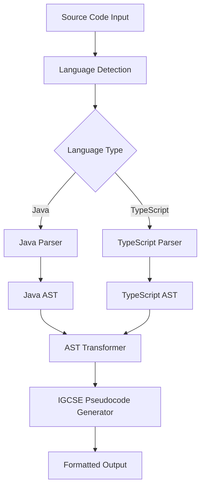

# Design Document

## Overview

java2igcseライブラリは、JavaとTypeScriptのソースコードを解析し、IGCSE準拠のpseudocodeに変換するTypeScriptライブラリです。このライブラリは、抽象構文木（AST）ベースのアプローチを使用して、正確で一貫性のある変換を提供します。

## Architecture



### Core Components

1. **Parser Layer**: 言語固有のパーサーがソースコードをASTに変換
2. **Transformer Layer**: ASTを中間表現に変換し、言語固有の特徴を正規化
3. **Generator Layer**: 中間表現からIGCSE pseudocodeを生成
4. **Formatter Layer**: 出力の整形とインデント管理

## Components and Interfaces

### 1. Main API Interface

```typescript
interface Java2IGCSEConverter {
  convertJava(sourceCode: string, options?: ConversionOptions): ConversionResult;
  convertTypeScript(sourceCode: string, options?: ConversionOptions): ConversionResult;
  convertCode(sourceCode: string, language: 'java' | 'typescript', options?: ConversionOptions): ConversionResult;
}

interface ConversionOptions {
  indentSize?: number;
  includeComments?: boolean;
  strictMode?: boolean;
  customMappings?: Record<string, string>;
}

interface ConversionResult {
  pseudocode: string;
  warnings: Warning[];
  success: boolean;
  metadata: ConversionMetadata;
}
```

### 2. Parser Interfaces

```typescript
interface SourceParser<T> {
  parse(sourceCode: string): ParseResult<T>;
  validate(sourceCode: string): ValidationResult;
}

interface ParseResult<T> {
  ast: T;
  errors: ParseError[];
  success: boolean;
}
```

### 3. AST Transformer Interface

```typescript
interface ASTTransformer<TInput, TOutput> {
  transform(ast: TInput): TransformResult<TOutput>;
}

interface IntermediateRepresentation {
  type: 'program' | 'statement' | 'expression' | 'declaration';
  kind: string;
  children: IntermediateRepresentation[];
  metadata: Record<string, any>;
}
```

### 4. Pseudocode Generator Interface

```typescript
interface PseudocodeGenerator {
  generate(ir: IntermediateRepresentation): string;
  formatOutput(pseudocode: string, options: FormattingOptions): string;
}
```

## Data Models

### IGCSE Pseudocode Mapping Rules

Based on `docs/igcse-psuedocode-rule.md` standards:

| Java/TypeScript Construct | IGCSE Pseudocode Equivalent |
|---------------------------|------------------------------|
| `if (condition) { ... }` | `IF condition THEN ... ENDIF` |
| `if-else if-else` | `IF condition1 THEN ... ELSE IF condition2 THEN ... ELSE ... ENDIF` |
| `switch/case` | `CASE OF variable ... ENDCASE` |
| `while (condition) { ... }` | `WHILE condition DO ... ENDWHILE` |
| `do-while` | `REPEAT ... UNTIL condition` |
| `for (int i = 0; i < n; i++)` | `FOR i ← 0 TO n-1 ... NEXT i` |
| `for (int i = 0; i < n; i += 2)` | `FOR i ← 0 TO n-1 STEP 2 ... NEXT i` |
| Nested loops | Proper indentation with inner loop structures |
| `public void method()` | `PROCEDURE method() ... ENDPROCEDURE` |
| `public int function()` | `FUNCTION function() RETURNS INTEGER ... ENDFUNCTION` |
| `static` methods/variables | `// Static method` + `PROCEDURE`/`FUNCTION` |
| Class inheritance | `// ChildClass inherits from ParentClass` |
| `int variable = 5;` | `DECLARE variable : INTEGER ← 5` |
| `String[] array = new String[10];` | `DECLARE array : ARRAY[1:10] OF STRING` |
| `System.out.println()` | `OUTPUT` |
| `Scanner.nextInt()` | `INPUT variable` |
| `==` | `=` |
| `!=` | `<>` |
| `&&` | `AND` |
| `||` | `OR` |
| `!` | `NOT` |
| `%` | `MOD` |
| `string.length()` | `LENGTH(string)` |
| `string.substring()` | `SUBSTRING(string, start, length)` |

### Conversion Context

```typescript
interface ConversionContext {
  currentScope: Scope;
  variableDeclarations: Map<string, VariableInfo>;
  functionDeclarations: Map<string, FunctionInfo>;
  indentLevel: number;
  options: ConversionOptions;
}

interface VariableInfo {
  name: string;
  type: IGCSEType;
  isArray: boolean;
  arrayDimensions?: number[];
}

interface FunctionInfo {
  name: string;
  parameters: Parameter[];
  returnType?: IGCSEType;
  isProcedure: boolean;
}
```

## Error Handling

### Error Categories

1. **Parse Errors**: ソースコードの構文エラー
2. **Conversion Errors**: サポートされていない構文や機能
3. **Validation Errors**: IGCSE pseudocode標準への準拠エラー

### Error Handling Strategy

```typescript
class ConversionError extends Error {
  constructor(
    message: string,
    public code: string,
    public line?: number,
    public column?: number,
    public suggestions?: string[]
  ) {
    super(message);
  }
}

enum ErrorCodes {
  PARSE_ERROR = 'PARSE_ERROR',
  UNSUPPORTED_FEATURE = 'UNSUPPORTED_FEATURE',
  TYPE_CONVERSION_ERROR = 'TYPE_CONVERSION_ERROR',
  VALIDATION_ERROR = 'VALIDATION_ERROR'
}
```

### Graceful Degradation

- サポートされていない機能に遭遇した場合、警告を生成し、可能な限り変換を続行
- 部分的な変換結果を提供し、問題のある箇所をコメントで示す
- 代替案や手動修正の提案を提供

## Testing Strategy

### Test-Driven Development Approach

The implementation will follow strict TDD principles:
1. Write failing tests first for each feature
2. Implement minimal code to make tests pass
3. Refactor while keeping tests green
4. Run full test suite before each commit
5. Commit to GitHub after each completed feature with passing tests

### Unit Testing

1. **Parser Tests**: 各言語パーサーの正確性をテスト
2. **Transformer Tests**: AST変換の正確性をテスト
3. **Generator Tests**: pseudocode生成の正確性をテスト
4. **Integration Tests**: エンドツーエンドの変換をテスト

### Test Data Categories

1. **Basic Constructs**: 変数、演算子、基本的な制御構造
2. **Complex Control Flow**: 
   - Nested loops (for within while, multiple levels)
   - Complex if-elif-else chains
   - Mixed control structures
3. **Object-Oriented Features**: 
   - クラス、メソッド、継承
   - Static methods and variables
   - Access modifiers
4. **Function vs Procedure Distinction**:
   - Methods with return values (FUNCTION)
   - Methods without return values (PROCEDURE)
   - Parameter passing
5. **Edge Cases**: 空のコード、コメントのみ、構文エラー

### Example Test Cases

```typescript
describe('Java to IGCSE Conversion', () => {
  test('converts simple if statement', () => {
    const input = 'if (x > 0) { System.out.println("positive"); }';
    const expected = 'IF x > 0 THEN\n    OUTPUT "positive"\nENDIF';
    expect(converter.convertJava(input).pseudocode).toBe(expected);
  });

  test('converts if-elif-else chain', () => {
    const input = 'if (x > 0) { print("pos"); } else if (x < 0) { print("neg"); } else { print("zero"); }';
    const expected = 'IF x > 0 THEN\n    OUTPUT "pos"\nELSE IF x < 0 THEN\n    OUTPUT "neg"\nELSE\n    OUTPUT "zero"\nENDIF';
    expect(converter.convertJava(input).pseudocode).toBe(expected);
  });

  test('converts nested loops', () => {
    const input = 'for (int i = 0; i < 3; i++) { for (int j = 0; j < 2; j++) { sum += i * j; } }';
    const expected = 'FOR i ← 0 TO 2\n    FOR j ← 0 TO 1\n        sum ← sum + (i * j)\n    NEXT j\nNEXT i';
    expect(converter.convertJava(input).pseudocode).toBe(expected);
  });

  test('distinguishes function vs procedure', () => {
    const voidMethod = 'public void printHello() { System.out.println("Hello"); }';
    const returnMethod = 'public int add(int a, int b) { return a + b; }';
    
    expect(converter.convertJava(voidMethod).pseudocode).toContain('PROCEDURE printHello()');
    expect(converter.convertJava(returnMethod).pseudocode).toContain('FUNCTION add(a : INTEGER, b : INTEGER) RETURNS INTEGER');
  });

  test('handles static methods with comments', () => {
    const input = 'public static void main(String[] args) { System.out.println("Hello"); }';
    const result = converter.convertJava(input).pseudocode;
    expect(result).toContain('PROCEDURE main');
    expect(result).toContain('// Static method');
  });

  test('handles inheritance with comments', () => {
    const input = 'class Dog extends Animal { public void bark() { System.out.println("Woof"); } }';
    const result = converter.convertJava(input).pseudocode;
    expect(result).toContain('// Dog inherits from Animal');
    expect(result).toContain('PROCEDURE bark()');
  });
});
```

### Performance Testing

- 大きなソースファイルでの変換速度測定
- メモリ使用量の監視
- 並行処理での安定性テスト

## Implementation Considerations

### IGCSE Standard Compliance

All conversions must strictly follow the rules defined in `docs/igcse-psuedocode-rule.md`:

- Use exact IGCSE keywords (BEGIN/END, IF/THEN/ENDIF, etc.)
- Follow IGCSE data type naming (INTEGER, REAL, STRING, CHAR, BOOLEAN)
- Use proper IGCSE operators (←, =, <>, AND, OR, NOT, MOD)
- Maintain IGCSE formatting and indentation standards
- Convert object-oriented concepts to procedural equivalents with comments

### Language-Specific Challenges

**Java:**
- オブジェクト指向機能の手続き型pseudocodeへの変換
- パッケージとインポートの処理（コメントで説明）
- 例外処理の変換（条件チェックとコメントに変換）
- Method overloading（異なる名前のprocedureに変換）

**TypeScript:**
- 型注釈の適切なIGCSE型への変換
- ES6+機能（アロー関数、分割代入など）の処理
- モジュールシステムの変換（コメントで説明）
- Genericsの除去と説明コメント

### Extensibility

- プラグインシステムによる新しい言語サポートの追加
- カスタム変換ルールの定義機能（IGCSE標準に準拠）
- 出力フォーマットのカスタマイズ機能